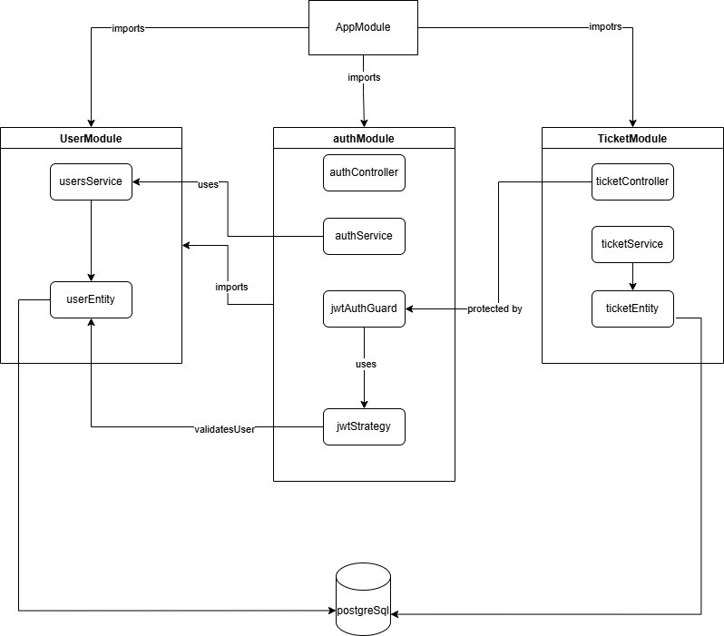

A simple Ticket Management REST API built with **NestJS**, **PostgreSQL**, **TypeORM**, and **JWT Authentication**.

## Features

* User signup and login
* Password hashing using bcrypt
* JWT-based authentication
* Create, read, update, and delete tickets
* Users can only access their own tickets
* Request validation using class-validator
* PostgreSQL database integration using TypeORM

## Tech Stack

* NestJS
* PostgreSQL
* TypeORM
* JWT
* bcrypt
* class-validator

<details>
  <summary>## High Level Architecture Diagram</summary>




</details>

## Project Setup

### 1. Clone the Repository

```bash
git clone https://github.com/Awais-Nazir/endpoint-backend-test.git
cd endpoint-backend-test
```

### 2. Install Dependencies

```bash
npm install
```

### 3. Create PostgreSQL Database

Create a PostgreSQL database either using pgadmin or SQL Editor:

```sql
CREATE DATABASE ticket_management;
```

### 4. Create `.env` File

Create a `.env` file in the root directory and add the following variables:

```env
PORT=3000

DB_HOST=localhost
DB_PORT=5432
DB_USERNAME=postgres
DB_PASSWORD=your_postgres_password
DB_DATABASE=ticket_management

JWT_SECRET=your_jwt_secret_key
JWT_EXPIRES_IN=86400
```

### 5. Run the Application

```bash
npm run start:dev
```

The server will start on:

```text
http://localhost:3000
```

## API Endpoints

### Authentication

| Method | Endpoint       | Description                 |
| ------ | -------------- | --------------------------- |
| POST   | `/auth/signup` | Register a new user         |
| POST   | `/auth/login`  | Login and receive JWT token |

### Tickets

All ticket routes require JWT authentication.

Use the token in the request header:

```text
Authorization: Bearer <access_token>
```

| Method | Endpoint       | Description                       |
| ------ | -------------- | --------------------------------- |
| POST   | `/tickets`     | Create a new ticket               |
| GET    | `/tickets`     | Get all tickets of logged-in user |
| GET    | `/tickets/:id` | Get a single ticket by ID         |
| PATCH  | `/tickets/:id` | Update a ticket                   |
| DELETE | `/tickets/:id` | Delete a ticket                   |

## Ticket Status Values

Allowed ticket status values are:

```text
open
in_progress
closed
```

By default, a new ticket is created with status:

```text
open
```

## Postman Collection

A Postman collection is included in the repository for testing the API endpoints.

Import the collection into Postman and follow this flow:

1. Signup a user
2. Login the user
3. Copy the returned access token
4. Add the token in the Authorization header
5. Test ticket CRUD APIs

## Notes

* Passwords are hashed before storing in the database.
* JWT is used to protect ticket routes.
* A user can only access, update, or delete their own tickets.
* TypeORM `synchronize` is enabled for development to automatically create database tables.

